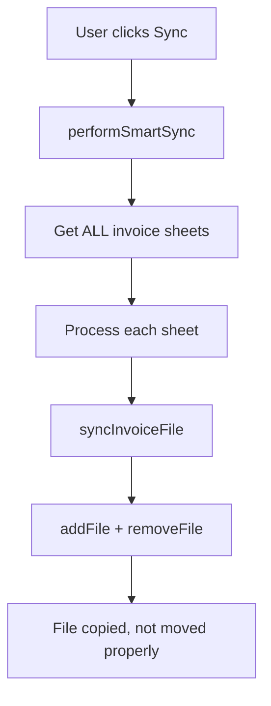
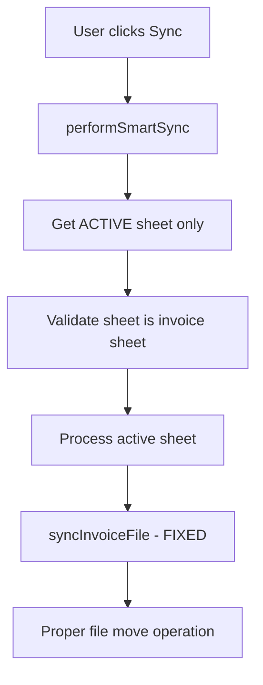

# Design Document - Drive Sync Fixes

## Overview

This design addresses two critical issues in the Drive synchronization system:
1. **File Copy vs Move Issue**: Files are being copied instead of moved, creating duplicates
2. **Sheet Selection Issue**: Sync processes all invoice sheets instead of just the active sheet

The solution involves modifying the `DriveSyncer.gs` file to fix the file move logic and restrict processing to the active sheet only.

## Architecture

### Current Architecture Problems



### Proposed Architecture



## Components and Interfaces

### Modified Functions

#### 1. `performSmartSync(targetFolder, log)`
**Current Issue**: Processes all invoice sheets
**Solution**: Process only the active sheet

```javascript
// BEFORE (problematic)
const sheets = ss.getSheets().filter(sheet => pattern.test(sheet.getName()));

// AFTER (fixed)
const activeSheet = ss.getActiveSheet();
if (!pattern.test(activeSheet.getName())) {
  throw new Error("הגיליון הנוכחי אינו גיליון חשבוניות");
}
const sheets = [activeSheet];
```

#### 2. `syncInvoiceFile(pdfLink, fileName, targetFolder, log)`
**Current Issue**: File move operation may not work correctly
**Solution**: Improve the move logic with better error handling

```javascript
// Enhanced move operation
targetFolder.addFile(sourceFile);

// Better parent removal logic
const parents = sourceFile.getParents();
while (parents.hasNext()) {
  const parent = parents.next();
  // Only remove from parents that are not the target folder
  if (parent.getId() !== targetFolder.getId()) {
    parent.removeFile(sourceFile);
  }
}
```

### New Validation Functions

#### 3. `validateActiveSheetForSync()`
**Purpose**: Ensure the active sheet is a valid invoice sheet before sync
**Returns**: Boolean indicating if sync can proceed

#### 4. `verifyFileMoveOperation(sourceFile, targetFolder)`
**Purpose**: Verify that file was properly moved (not copied)
**Returns**: Boolean indicating successful move

## Data Models

### Sync Operation Result
```javascript
{
  sheetName: string,           // Name of processed sheet
  totalProcessed: number,      // Total records checked
  totalMoved: number,          // Files actually moved (not copied)
  totalSkipped: number,        // Files skipped (already exist)
  totalErrors: number,         // Errors encountered
  moveVerified: boolean        // Whether moves were verified
}
```

### File Operation Status
```javascript
{
  fileName: string,
  operation: 'moved' | 'downloaded' | 'skipped' | 'error',
  originalLocation: string,    // For moved files
  newLocation: string,         // Target location
  verified: boolean            // Whether operation was verified
}
```

## Error Handling

### File Move Errors
- **Permission Issues**: Log error, continue with next file
- **File Not Found**: Log warning, create text backup with link
- **Target Folder Issues**: Fail fast, stop sync operation

### Sheet Validation Errors
- **Non-Invoice Sheet**: Display clear error message, stop operation
- **Empty Sheet**: Log warning, complete with zero results
- **Missing Columns**: Log error, stop operation

### Verification Errors
- **Move Not Completed**: Log error, attempt manual cleanup
- **Duplicate Detection**: Log warning, user notification

## Testing Strategy

### Unit Tests
- `validateActiveSheetForSync()` with various sheet types
- `verifyFileMoveOperation()` with different file states
- `extractDriveFileId()` with various URL formats

### Integration Tests
- Full sync operation on active sheet only
- File move verification after sync
- Error handling for various failure scenarios

### Manual Testing Scenarios
1. **Active Sheet Sync**: Verify only current sheet is processed
2. **File Move Verification**: Check that files are moved, not copied
3. **Error Recovery**: Test behavior when files can't be moved
4. **Progress Reporting**: Verify accurate progress updates

## Implementation Plan

### Phase 1: Sheet Selection Fix
1. Modify `performSmartSync()` to use active sheet only
2. Add sheet validation before processing
3. Update progress messages to show active sheet name

### Phase 2: File Move Fix
1. Enhance `syncInvoiceFile()` move logic
2. Add move verification
3. Improve error handling for move operations

### Phase 3: Verification & Logging
1. Add move verification function
2. Enhance logging to distinguish moves from copies
3. Update result summary to show move statistics

## Risk Mitigation

### Data Loss Prevention
- Always verify file exists in target before removing from source
- Implement rollback mechanism for failed moves
- Maintain detailed operation logs

### Performance Considerations
- Process only active sheet reduces processing time
- Batch verification operations where possible
- Limit verification attempts to prevent timeouts

### User Experience
- Clear error messages in Hebrew
- Progress indicators for long operations
- Detailed success/failure summaries